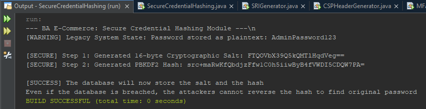
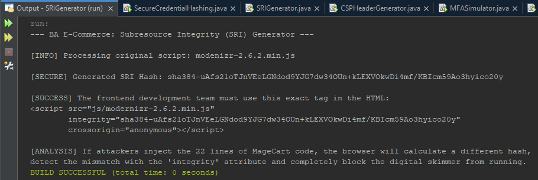
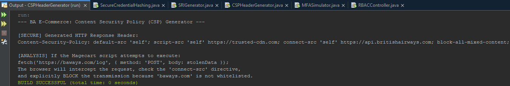
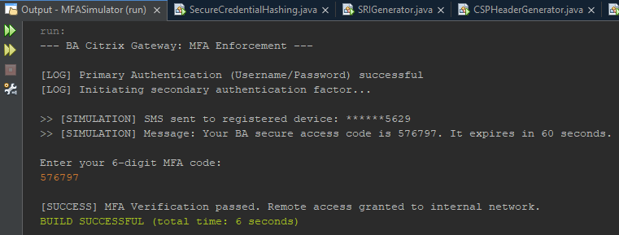
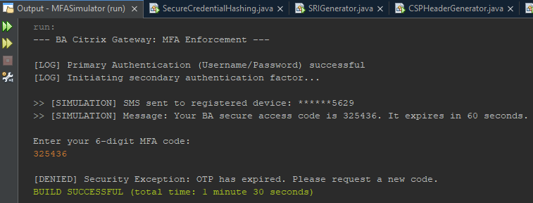
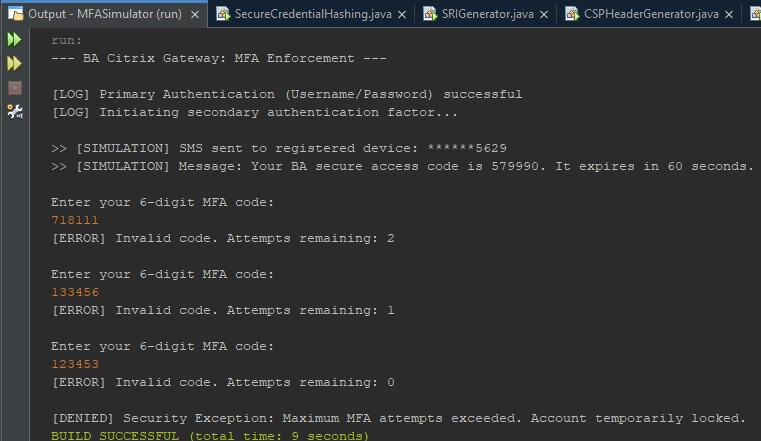
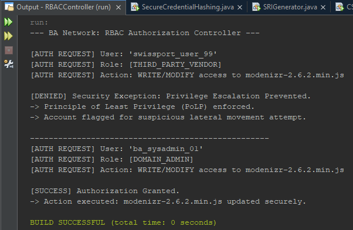

<a id="readme-top"></a>


<div align="center">

 <h3 align="center">Secure Coding Solutions: British Airways Case Study</h3>


 <p align="center">

   Executable Java implementations to mitigate critical security vulnerabilities.

 </p>

</div>


<details>

 <summary>Table of Contents</summary>

 <ol>

   <li><a href="#about-the-project">About The Project</a></li>

   <li><a href="#built-with">Built With</a></li>

   <li><a href="#getting-started">Getting Started</a></li>

   <li><a href="#secure-coding-solutions">Secure Coding Solutions</a>
      <ul>
        <li><a href="#1-secure-credential-hashing">Secure Credential Hashing</a></li>
        <li><a href="#2-subresource-integrity-sri-generator">Subresource Integrity (SRI) Generator</a></li>
        <li><a href="#3-content-security-policy-csp-generator">Content Security Policy (CSP) Generator</a></li>
        <li><a href="#4-multi-factor-authentication-mfa-simulator">Multi-Factor Authentication (MFA) Simulator</a></li>
        <li><a href="#5-role-based-access-control-rbac-simulator">Role-Based Access Control (RBAC) Simulator</a></li>
      </ul>
    </li>

   <li><a href="#team">Team</a></li>

   <li><a href="#acknowledgments">Acknowledgments</a></li>

 </ol>

</details>


## About The Project


This repository contains proof-of-concept (PoC) Java solutions designed to remediate the vulnerabilities identified in the 2018 British Airways data breach. The project demonstrates the implementation of industry-standard security controls, including cryptographic hashing and secure data handling, to prevent privilege escalation and credential compromise.


<p align="right">(<a href="#readme-top">back to top</a>)</p>


## Built With

*   **Java (Standard Edition):** Core programming language used for all Proof of Concept (PoC) solutions.
*   **NetBeans IDE:** Integrated Development Environment used for compiling and executing the standalone programs.
*   **`javax.crypto`:** Utilized for advanced key generation (`PBKDF2WithHmacSHA256`) in the Secure Credential Hashing solution.
*   **`java.security`:** Utilized for cryptographic hashing (`MessageDigest` / SHA-384) in the SRI Generator, and for generating non-deterministic entropy (`SecureRandom`) in the MFA and Hashing simulators.
*   **`java.util.Base64`:** Utilized to properly encode the cryptographic byte arrays into valid HTML attributes for the SRI tags.


<p align="right">(<a href="#readme-top">back to top</a>)</p>


## Getting Started


To run these solutions, ensure you have the Java Development Kit (JDK) installed.


### Prerequisites


* JDK 8 or higher

* NetBeans IDE (or any Java-compatible IDE)


### Installation


1. Clone the repo

  ```sh

  git clone https://github.com/TingRongYou/Y3S1SoftwareSecurityAndSafety.git

  ```

2. Open the project folder in NetBeans

3. Build and run the `SecureCredentialHashing.java` (or subsequent solution) file to see the PoC output.


<p align="right">(<a href="#readme-top">back to top</a>)</p>


<!-- Secure Coding Solutions -->

## Secure Coding Solutions


### 1. Secure Credential Hashing

This solution addresses the **Plaintext Storage of Credentials** vulnerability. It uses the `PBKDF2WithHmacSHA256` algorithm to perform iterative, salted hashing on administrator passwords.


*   **Key Security Features:**

     *   **Cryptographic Salt:** Uses `SecureRandom` (16-byte) to defend against offline dictionary attacks.

    *   **Work Factor:** Implements 600,000 iterations to act as a computational bottleneck against brute-force attempts.

    *   **Irreversibility:** Produces a 256-bit hash, ensuring credentials cannot be reversed even if the database is compromised.

    <div align="center">
      <a href="docs/img/SecureCredentialHashingOutput.png">
       
       </a>
      <h3 align="center">Secure Credential Hashing Output</h3>
    </div>

### 2. Subresource Integrity (SRI) Generator

This solution addresses the **Malicious Script Injection** vulnerability. It acts as a secure deployment tool that programmatically calculates the cryptographic hash of legitimate JavaScript files to prevent the execution of unauthorized, manipulated code (such as the Magecart digital skimmer).

*   **Key Security Features:**
    *   **Cryptographic Baseline:** Uses the W3C-recommended `SHA-384` algorithm to create an immutable mathematical fingerprint of the trusted source code prior to deployment.
    *   **Browser-Level Enforcement:** Generates secure HTML `<script>` tags containing the `integrity` attribute, forcing client browsers to independently verify the file's hash before execution.
    *   **Server-Side Breach Defense:** Completely neutralizes data exfiltration attempts by blocking script execution if threat actors manage to alter the `.js` files on the compromised server.

    <div align="center">
      <a href="docs/img/SRIGeneratorOutput.png">
       
      </a>
      <h3 align="center">SRI Generator Output</h3>
    </div>

### 3. Content Security Policy (CSP) Generator

This solution addresses the **Unrestricted Data Exfiltration (Security Misconfiguration)** vulnerability. It simulates a backend middleware component that programmatically generates and injects a strict CSP HTTP header into all outbound web server responses.

*   **Key Security Features:**
    *   **Restricting Data Transmission (`connect-src`):** Instructs the browser to only permit outbound data transmissions to the origin server or the official API, strictly blocking data exfiltration to unauthorized domains.
    *   **Restricting Execution Sources (`script-src`):** Creates an explicit whitelist of trusted domains, ensuring the browser refuses to load malicious external scripts.
    *   **Preventing Protocol Downgrades (`block-all-mixed-content`):** Ensures secure HTTPS pages do not load resources over unencrypted HTTP connections, preventing Man-in-the-Middle (MitM) attacks.

    <div align="center">
      <a href="docs/img/CSPHeaderGeneratorOutput.png">
      
      </a>
      <h3 align="center">CSP Header Generator Output</h3>
    </div>
  
### 4. Multi-Factor Authentication (MFA) Simulator

This solution addresses the **Absence of Multi-Factor Authentication (MFA) on Remote Gateways** vulnerability. It simulates a secure backend mechanism that mandates a secondary authentication layer for internal and third-party access gateways.

*   **Key Security Features:**
    *   **Cryptographic Entropy:** Utilizes Java's `SecureRandom` class to generate a non-deterministic 6-digit One-Time Password (OTP) leveraging the operating system's internal entropy pool.
    *   **Time-to-Live (TTL) Expiration:** Enforces a strict 60-second expiration window to automatically invalidate the OTP, directly mitigating Replay Attacks.
    *   **Brute-Force Rate Limiting:** Implements a maximum attempt threshold (3 attempts) that temporarily locks the authentication thread to prevent automated script guessing.

    <div align="center">
      <a href="docs/img/MFAOTPSuccess.png">
      
      </a>
      <h3 align="center">MFA OTP Success</h3>
    </div>

    <div align="center">
      <a href="docs/img/MFAOTPExpiration.png">
      
      </a>
      <h3 align="center">MFA OTP Expiration</h3>
    </div>

    <div align="center">
      <a href="docs/img/MFAOTPBruteForceAttempt.png">
      
      </a>
      <h3 align="center">MFA OTP Brute Force Attempt</h3>
    </div>

### 5. Role-Based Access Control (RBAC) Simulator

This solution addresses the **Ineffective Role-Based Access Control (RBAC) and Privilege Escalation** vulnerability. It acts as a secure backend Authorization Controller that prevents unauthorized lateral movement within the network.

*   **Key Security Features:**
    *   **Immutable Role Definitions:** Categorizes accounts explicitly (e.g., Admin vs. Third-Party Vendor) using rigid enumeration to prevent runtime manipulation.
    *   **Principle of Least Privilege (PoLP):** Defaults to a "deny-all" state, verifying that an account holds the exact required administrative role before permitting write-access to sensitive production files.
    *   **Lateral Movement Prevention:** Completely breaks the attack chain by preventing external or standard accounts from breaking out of their authorized micro-segments to modify web assets.

    <div align="center">
      <a href="docs/img/RBACControllerOutput.png">
      
      </a>
      <h3 align="center">RBAC Controller Output</h3>
    </div>


<p align="right">(<a href="#readme-top">back to top</a>)</p>


<!-- TEAM -->

## Team


* Ting Rong You

* Yong Chong Xin

* Lim Wen Liang

* Anson Chang

* Wan Zi Kang

* Nur Aina Lee


<p align="right">(<a href="#readme-top">back to top</a>)</p>


<!-- ACKNOWLEDGMENTS -->
## Acknowledgments

* [NIST SP 800-63B Digital Identity Guidelines](https://doi.org/10.6028/NIST.SP.800-63b)
* [OWASP Password Storage Cheat Sheet](https://cheatsheetseries.owasp.org/cheatsheets/Password_Storage_Cheat_Sheet.html)
* [OWASP Top 10:2021 - Cryptographic Failures](https://owasp.org/Top10/A02_2021-Cryptographic_Failures/)
* [W3C Subresource Integrity Specification](https://www.w3.org/TR/SRI/)
* [W3C Content Security Policy Level 3](https://www.w3.org/TR/CSP3/)
* [OWASP Top 10:2021 - Security Misconfiguration](https://owasp.org/Top10/A05_2021-Security_Misconfiguration/)
* [PCI SSC Bulletin on the Threat of Online Skimming](https://listings.pcisecuritystandards.org/pdfs/PCISSC_Magecart_Bulletin_RHISAC_FINAL.pdf)


<p align="right">(<a href="#readme-top">back to top</a>)</p>

